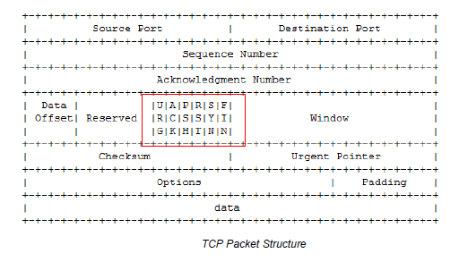
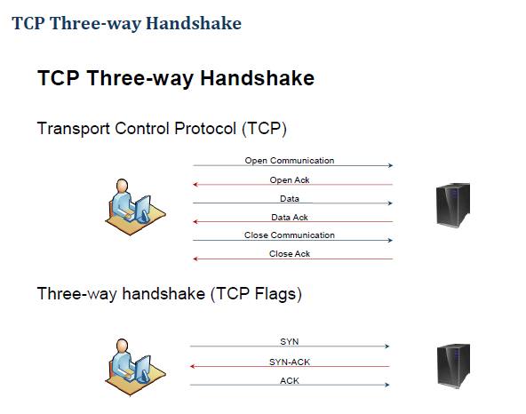
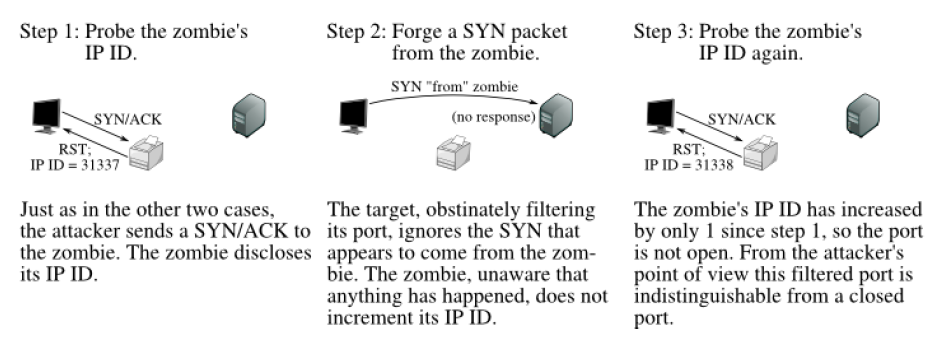

**Port Scanning**

The process of identifying open and available TCP or UDP ports on a
system

Port scanning tools enable a pen tester to learn about what services are
running on a host.

Each service on a system is typically associated with a well-known port
number.

Common tools:

-   NMAP

-   HPING

TCP Flags are a critical part of scanning

| Urg | Urgent          | Indicates data is sent out of band                    |
|-----|-----------------|-------------------------------------------------------|
| ACK | Acknowledgement | Set in response to a TCP packet with the SYN flag set |
| PSH | Push            | Force's delivery of data without care for buffering   |
| RST | Reset           | Force's termination of session                        |
| SYN | Synchronize     | Set during initial session establishment              |
| FIN | Finish          | Used to properly close a session                      |

**Nmap**

A powerful free, open-source tool for network examination

Features:

-   Port Scanning

-   OS Detection

-   Version Detection

-   Ping Sweet

-   Ability to scan many machines at once

-   Supported by numerous OS

| `sS` | SYN Stealh Scan | Performs a scan using the initial TCP Handshake but sends a RST instead of ACK                                                                                                                                                 |
|------|-----------------|--------------------------------------------------------------------------------------------------------------------------------------------------------------------------------------------------------------------------------|
| `sT` | TCP Scan        | Performs a scan using the full TCP Handshake. Very reliable results but very loud and will most likely be logged by most hosts due to full connection on each listening port. Combine with `-i` to query for the process owner |
| `sP` | Ping Scan       | Performs a routing ICMP ping of the host                                                                                                                                                                                       |

**Nmap FIN, NULL, and Xmas Scans**

Look for closed ports rather than open ports.\
Do not work on windows hosts

-   Due to Microsoft not following RFC793

    -   Requires closed ports to respond with a RST and open ports to
        not respond to the following types of scans

    -   Windows does not respond with the proper flags set so all ports
        will come back as open

| `sF` | FIN Scan  | Sends packets with FIN flag set     |
|------|-----------|-------------------------------------|
| `sN` | Null Scan | Sends packets with no flags set     |
| `sX` | Xmas Scan | Sends packets with FIN, URG, & PSH. |

**Nmap ACK Scan -- Firewall Rule sets**

`-sA` -- ACK Scan

-   Used to map firewall rules and can distinguish between stateful and
    stateless firewalls

-   Sends ACK packets to a host to determine if the port is
    filtered/unfiltered.

    -   If the host responds with a RST

        > The host is not being filtered by a firewall.

    -   If nothing comes back

        > The port is "filtered" or there is a firewall preventing the RST from coming back.

-   Can help determine if a firewall is stateless (just blocks incoming
    SYN packets) or stateful (tracks connections and also blocks
    unsolicited ACK packets)

**Nmap Window, RPC & List Scans**

| `sw` | Window Scan | Same as ACK scan `sA` but can determine if the port is open by analyzing the TCP window size set in the packet by the OS |
|------|-------------|--------------------------------------------------------------------------------------------------------------------------|
| `sR` | RPC Scan    | Scans host's port to determine if the service is an RPC service, and which program and/or version is installed.          |
| `sL` | List Scan   | Prints a list of IPs that will be scanned but does not actually send any packets                                         |

**Nmap UDP, IP, & Bounce Scan**

| `sU` | UDP Scan         | Scans for open UDP ports. Default is to scan for the internet's top 1000 UDP ports. You can customize the scan with the `-p` to limit or modify the default scan                                         |
|------|------------------|----------------------------------------------------------------------------------------------------------------------------------------------------------------------------------------------------------|
| `sO` | IP Protocol Scan | Determines which IP protocols are supported by the target host by sending raw IP packets minus additional protocol headers.                                                                              |
| `b`  | FTP Bounce Scan  | Exploits of the FTP protocol where the attacker utilizes the `PORT` command to request access to ports indirectly through the use of a "Proxy" FTP system. Used to mask the true source of the attacker. |

**Nmap Decoy, OS Fingerprinting, & Version**

| `-D <decoy1, decoy2, [ME], ...>` |                   | Used when attempting to hide from an IDS. Produces scan traffic from "decoy" IPs allowing your IP and scan to hide in the noise                                                                                                                                              |
|----------------------------------|-------------------|------------------------------------------------------------------------------------------------------------------------------------------------------------------------------------------------------------------------------------------------------------------------------|
| `O`                              | OS Fingerprinting | Attempts to determine the target host's OS and version/Patch level. OS detection is more effective if the target host has at least one open and one closed TCP port. Use the `--osscan-limit` option to prevent Nmap from scanning hosts that do not even meet this criteria |
| `sV`                             | Version Scan      | Attempts to determin the service and version of the service using port                                                                                                                                                                                                       |

**Other Nmap Options**

No Ping

-   `-PN` -- Disable ping during scan

Name Resolution

`-n` -- Disables name resolution of target hosts\
`-R` -- Resolves names to IP addresses

Verbose

`-v` -- Verbose Mode

`-vv` -- Very Verbose Mode

**Nmap Idle Scan**

**`-sl` -- Idle Scan**

-   TCP scan that sends spoofed packets to a target and observes the
    response to the Zombie (spoofed computer)

**Hping**

Like nmap, a port scanning tool, but allows much more packet
customization

| `-M --setseq` | Set TCP sequence number  |
|---------------|--------------------------|
| `-L --setack` | Set TCP Ack              |
| `-F --fin`    | Set FIN Flag             |
| `-S --syn`    | Set SYN Flag             |
| `-R --rst`    | Set RST Flag             |
| `-P --push`   | Set PUSH Flag            |
| `-A --ack`    | Set ACK Flag             |
| `-U --urg`    | Set URG Flag             |
| `-X --xmas`   | Set X unused flag `0x40` |
| `-Y --ymas`   | Set Y unused Flag `0x80` |
