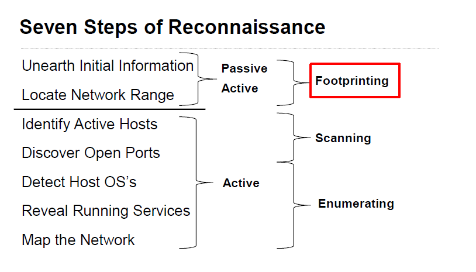

Phase 1 -- Reconnaissance

-   Do they have a presence on the internet?`www.domain.info`

-   Can I find their IP space? `nslookup` set type=mx  domain.info`

-   Can I find its employee's email addresses/phone numbers?

-   Can I build a hierarchy of the employees?

-   Can I build a relationship map to other companies?

-   Can I build an understanding of their security
    posture/policies/infrastructure?

**Passive & Active Recon**

**Passive Reconnaissance** -- gathering information on a target without
their knowledge of your actions.

-   Example: Using the internet to research a target (domain
    registrations, web pages, email addresses)

**Active Reconnaissance** -- gathering information on a target where the
potential exists that your actions will be seen by the target.

-   Example: Port scanning the target domain's network looking for hosts
    and open services

Information Gathering

Sometimes referred to as open-source intelligence, is the action of
searching for publicly available information via the internet, or
"open-sources", to build a map/understanding of the organization, its
people/employees, and relationships to other organizations

Main Tools

Search engines/sites -- improve information gathering on a target
organization by using search engine tags

DNS(Domain Name System)- Determine IP space

Footprinting

Part of reconnaissance phase -- often, the terms footprinting and
reconnaissance are used interchangeably.

Process of gathering information to create a blueprint or map of an org
network and systems

Objective is to gain insight into the target -- to "know your enemy"

Footprinting is one of three pre-attack phases:

